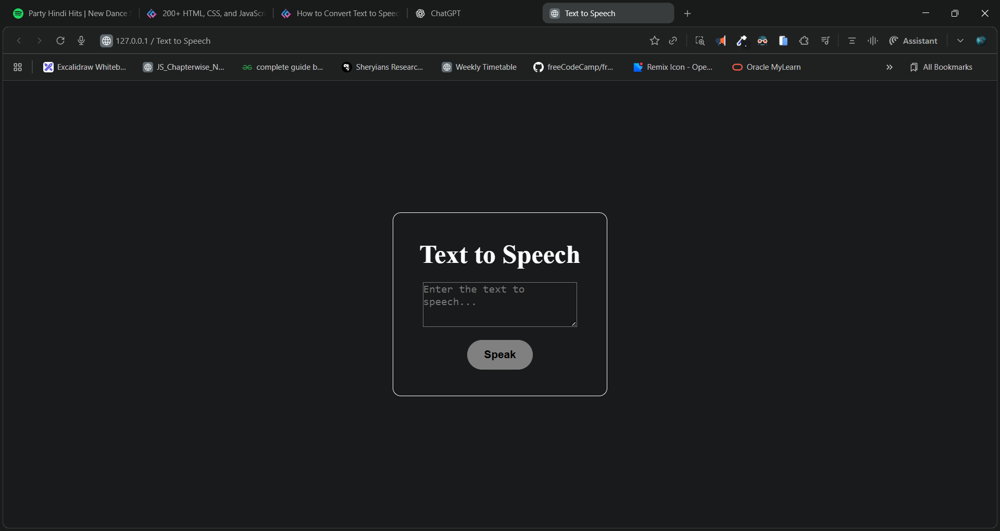

# 🗣️ Text to Speech Web App

A simple, modern **Text-to-Speech (TTS)** web application built with **HTML**, **CSS**, and **JavaScript**.  
This app allows users to type or paste text and hear it spoken aloud using the browser’s built-in Speech Synthesis API.

---

## 🚀 Live Demo

👉 **[View Live Project]()**  

---

## 🖼️ Preview

  

---

## 🎥 Demo Video

▶️ [Watch Demo Video](./demo.mp4)  

---

## 🧠 Features

- 🎙️ Converts text input into speech  
- 🌐 Supports multiple voices (depending on browser support)  
- ⚙️ Adjustable rate, pitch, and voice selection (can be extended easily)  
- 💻 Simple and clean UI with dark theme  

---

## 🧩 Technologies Used

- **HTML5** – Page structure  
- **CSS3** – Styling and layout  
- **JavaScript (ES6)** – Speech synthesis functionality  

---

## 🛠️ How to Run Locally

1. Clone this repository:
   ```bash
   git clone 

2. Open the project folder:

   ```bash
   cd text-to-speech
   ```

3. Open `index.html` in your browser:

   ```bash
   open index.html
   ```

   *(or simply drag it into your browser)*

---

## 📂 Project Structure

```
text-to-speech/
│
├── index.html      # Main HTML file
├── style.css       # Stylesheet
└── script.js       # JavaScript logic
```

---

## 🗣️ How It Works

1. Enter any text in the input box.
2. Click **Speak**.
3. The browser’s speech engine will read the text aloud.

> 💡 This uses the built-in **Web Speech API** — no external libraries required!

---

## 📸 Example

```
Input: "Hello, welcome to my text-to-speech app!"
Output: (Speech)
```

---

## 💬 Author

👤 **Dileep kumawat**
- 📧 [dileepkumawat525@gmail.com](mailto:dileepkumawat525@gmail.com)
- 🔗 [LinkedIn](https://www.linkedin.com/in/dileep-kumawat/)

---

## 📝 License

This project is licensed under the **MIT License** — feel free to modify and share.

---

### ⭐ If you like this project, please star the repo!